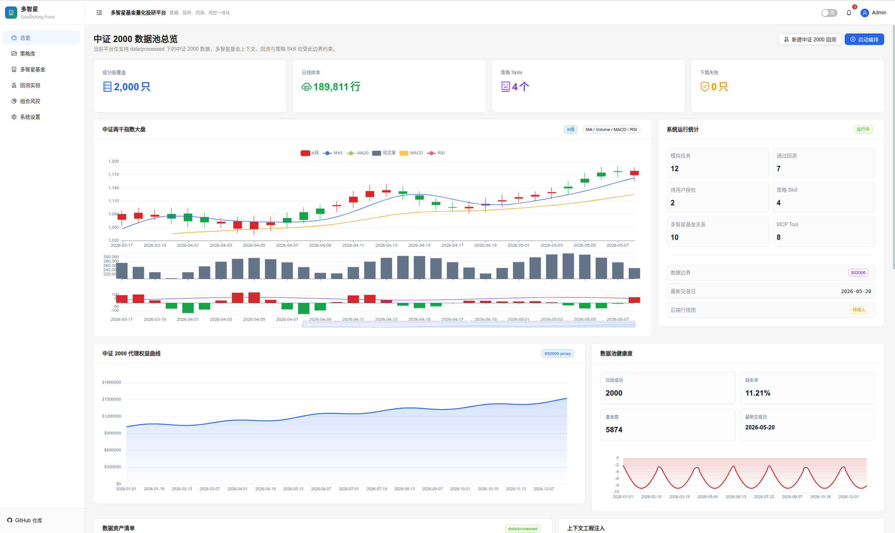
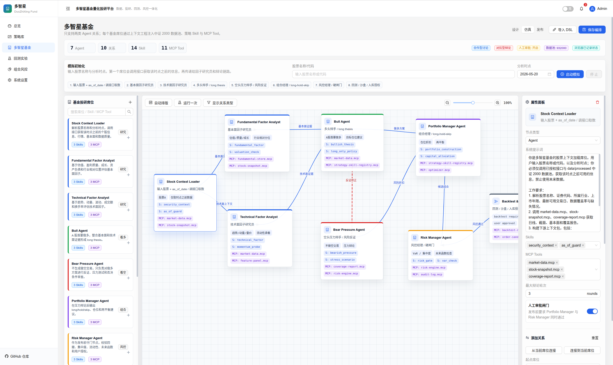
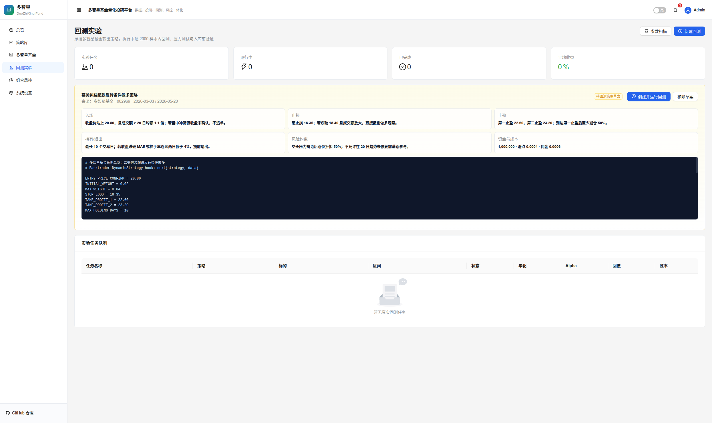

<h1 align="center">多智星 —— 多智能体量化回测平台</h1>

<p align='center'><strong>西南财经大学《算法交易》课程项目</strong></p>

<p align="center">
<a href="#">

</a>
<a href="#">

</a>
<a href="#">

</a>
<a href="#">

</a>

</p>


**多智星** 是一款面向金融场景的**低代码多智能体量化回测平台**。平台以降低量化策略开发门槛为核心目标，通过融合基于大语言模型的多智能体协作与专业级回测引擎，模拟专业基金公司，为用户提供从策略构思、回测验证到智能决策的一站式解决方案。


<p align='center'>多智星平台界面</p>


<p align='center'>低代码平台</p>


<p align='center'>回测引擎</p>

---

## 项目概述

### Situation

在量化投资领域，传统策略开发面临三大痛点：

1. **技术门槛高**：策略编写需要熟练掌握 Python 及量化框架，非技术背景的研究人员难以快速上手。
2. **决策单一化**：现有平台多为单策略回测，缺乏多维度、多角色的智能决策支持。
3. **验证标准缺失**：策略在不同数据集上的表现差异巨大，缺乏统一、稳健的验证标准，导致"过拟合"风险难以识别。

我们希望通过一个综合性项目，探索如何将前沿的大模型智能体技术与传统量化回测框架相结合，构建一个更智能、更易用、更严谨的量化研究与验证平台。

### Task

本项目旨在构建一个**低代码、多智能体、标准化验证**的量化回测平台，具体目标包括：

- **降低策略开发门槛**：提供低代码策略编写环境，用户可通过界面快速构建和编辑策略。
- **引入智能体协作决策**：设计多智能体工作流，模拟真实投研团队的角色分工（分析师、多头/空头、风控、执行），提升决策质量。
- **建立标准化策略库**：策略必须通过标准数据集回测验证，并经用户授权后方可注入为可调用的 Skill，确保策略质量可控。
- **提供专业级回测能力**：基于成熟的回测引擎，支持多维度的绩效分析与可视化展示。

### Action

为实现上述目标，我们采用了前后端分离的现代化架构，并集成了多项核心技术：

- **后端架构**：基于 **FastAPI** 构建高性能异步 API 服务
- **回测引擎**：以 **Backtrader** 为核心回测引擎，封装 `BacktestEngine` 支持动态策略加载（`DynamicStrategy`）。
- **多智能体系统**：基于 **LangChain / LangGraph** 构建智能体工作流，实现分析师（Analyst）、多头/空头（Bull/Bear）、风控经理（Risk Manager）、执行器（Executor）的协作与辩论机制。
- **前端界面**：采用 **React 18 + TypeScript + Vite** 构建现代化单页应用，使用 **Ant Design** 作为 UI 组件库，**Zustand** 进行状态管理，**ECharts** 实现数据可视化。
- **策略 Skill 库**：设计策略生命周期管理机制，策略生成后必须通过**中证 2000** 数据集回测验证，并在用户人工授权后注入 Skill Registry，成为多智能体可调用的策略资产。
- **数据支持**：集成 **yfinance** 与 **ccxt** 获取市场数据，并以**中证 2000** 成分股作为平台的标准验证数据池。

### Result

平台成功实现了以下核心能力：

- **低代码策略开发**：用户无需配置复杂环境，即可在 Web 界面编写 Python 策略代码并一键回测，显著降低策略原型开发周期。
- **多智能体协作决策**：通过 Analyst → Bull/Bear 辩论 → Risk Manager → Executor 的完整工作流，模拟专业投研团队的决策过程，提供更具参考价值的交易信号。
- **标准化策略验证**：以中证 2000 作为统一验证基准，所有策略必须通过该数据集回测后才能进入 Skill 库，有效识别过拟合策略。
- **用户可控的策略资产**：策略注入采用"人工授权"强制闸门，用户拥有对策略资产的完全控制权，确保系统安全与合规。
- **专业级回测报告**：基于 Backtrader 提供收益率、夏普比率、最大回撤、交易明细、权益曲线等多维度分析指标。

---

## 技术栈详解

| 层级 | 技术选型 | 说明 |
|------|----------|------|
| **前端框架** | React 18 + TypeScript + Vite | 现代化前端工程化方案，支持热更新与高效构建 |
| **UI 组件库** | Ant Design 5 | 企业级 UI 设计体系，提供丰富的数据展示组件 |
| **状态管理** | Zustand | 轻量级状态管理，支持异步操作与中间件 |
| **数据可视化** | ECharts + @ant-design/charts | 专业级图表库，支持 K 线图、权益曲线、绩效分析等 |
| **后端框架** | FastAPI | 高性能异步 Python Web 框架，原生支持 OpenAPI 文档 |
| **数据库** | SQLite (aiosqlite) + SQLAlchemy 2.0 | 异步 ORM 与数据库迁移，适合量化研究场景 |
| **回测引擎** | Backtrader | 成熟的 Python 量化回测框架，支持多标的、多周期、自定义指标 |
| **智能体框架** | LangChain + LangGraph | 大语言模型应用开发框架，支持复杂智能体工作流编排 |
| **数据获取** | akshare | 覆盖股票市场数据 |
| **环境管理** | uv | 极速 Python 包管理与虚拟环境工具 |
| **安全认证** | JWT (python-jose) + bcrypt | 基于 Token 的用户认证与密码加密（目前未使用） |

---

## 核心特色与创新

### 1. 基于金融场景的低代码智能体平台

平台将大语言模型智能体与量化回测深度结合。用户不仅可以通过低代码界面快速编写策略，还可以启动多智能体基金工作流，让 AI 扮演分析师、交易员、风控经理等角色，模拟真实投研团队的协作过程，自动生成交易信号与决策报告。

### 2. Baseline 策略与自更新机制

平台内置多种 Baseline 策略（如双均线 SMA 交叉），帮助用户快速上手。同时支持**用户自更新策略**：通过 `DynamicStrategy` 动态编译用户编写的 Python 代码，无需重启服务即可运行新策略，实现策略的快速迭代与验证。

### 3. Skill 策略库 —— 策略即资产

平台将策略定位为可复用的 **Skill**。每条策略都有完整的生命周期：

- **生成**：用户编写或智能体生成候选策略
- **验证**：必须通过**中证 2000** 数据集回测，验证策略在 A 股小市值股票池中的稳健性
- **授权**：用户人工审核并授权后，策略才能被注入 Skill Registry
- **调用**：已注入的 Skill 可被多智能体基金席位直接调用，参与实际交易决策

这种机制确保了策略库的质量可控，同时赋予用户对策略资产的完全掌控权。

### 4. 基于 Backtrader 的专业回测平台

底层基于 **Backtrader** 构建，支持：

- 多标的同步回测
- 自定义滑点（Slippage）与手续费（Commission）
- 自定义 Analyzer（交易记录器、权益曲线记录器等）
- 丰富的绩效指标：总收益、年化收益、夏普比率、最大回撤、胜率等

### 5. 中证 2000 标准数据集

平台以**中证 2000** 指数成分股作为标准验证数据池。中证 2000 覆盖了 A 股市场大量小市值公司，具有分散度高、风格鲜明的特点，是检验策略泛化能力的理想基准。所有进入 Skill 库的策略都必须通过该数据集的回测验证，有效避免过拟合。

---

## 项目架构

```
QuantTrader/
├── backend/                  # FastAPI 后端
│   ├── app/
│   │   ├── api/v1/           # RESTful API 路由
│   │   ├── core/             # 核心引擎（Backtrader 封装）
│   │   ├── models/           # SQLAlchemy 数据模型
│   │   ├── schemas/          # Pydantic 数据校验
│   │   ├── services/         # 业务逻辑层
│   │   │   ├── agents/       # 多智能体系统（Analyst / Bull / Bear / Risk / Executor）
│   │   │   ├── backtest_service.py
│   │   │   ├── data_service.py
│   │   │   └── agent_service.py
│   │   ├── config.py         # 应用配置
│   │   ├── database.py       # 数据库连接与初始化
│   │   └── main.py           # 应用入口
│   ├── pyproject.toml        # uv 依赖管理
│   └── quant_trader.db       # SQLite 数据库（开发环境）
│
├── frontend/                 # React 前端
│   ├── src/
│   │   ├── api/              # HTTP 请求封装
│   │   ├── components/       # 通用组件（图表、布局、统计卡片）
│   │   ├── pages/            # 页面级组件
│   │   │   ├── dashboard/    # 仪表盘
│   │   │   ├── strategy/     # 策略 Skill 库
│   │   │   ├── backtest/     # 回测管理
│   │   │   ├── agents/       # 智能体管理
│   │   │   └── portfolio/    # 投资组合
│   │   ├── stores/           # Zustand 状态管理
│   │   ├── types/            # TypeScript 类型定义
│   │   └── utils/            # 工具函数与 Mock 数据
│   ├── package.json
│   └── vite.config.ts
│
├── .gitignore
└── AGENTS.md                 # 多智能体设计文档
```

---

## 多智能体工作流

平台的核心智能体协作流程如下：

1. **Analyst Agent（分析师）**：基于技术指标与基本面数据，生成初始交易信号。
2. **Bull Agent & Bear Agent（多头 / 空头辩论）**：分别站在看多与看空角度，对 Analyst 的信号进行辩论与修正。
3. **Risk Manager（风控经理）**：综合所有信号，评估仓位风险、止损线与组合风险暴露。
4. **Executor（执行器）**：在风控通过的前提下，生成最终可执行订单。

整个流程由 `FundOrchestrator` 统一调度，支持状态持久化与可视化追踪。

---

## 快速开始

### 环境要求

- Python >= 3.11
- Node.js >= 18
- uv（Python 包管理器）

### 后端启动

```bash
cd backend
uv sync
uv run python -m app.main
```

服务将运行在 `http://localhost:8000`，自动文档地址：`http://localhost:8000/docs`

### 前端启动

```bash
cd frontend
npm install
npm run dev
```

前端将运行在 `http://localhost:3000`

---

## 课程信息

- **课程**：西南财经大学《算法交易》
- **项目名称**：多智星（QuantTrader）
- **项目定位**：多智能体量化回测与策略验证平台

---

## 许可证

本项目仅供学术交流与课程学习使用。
